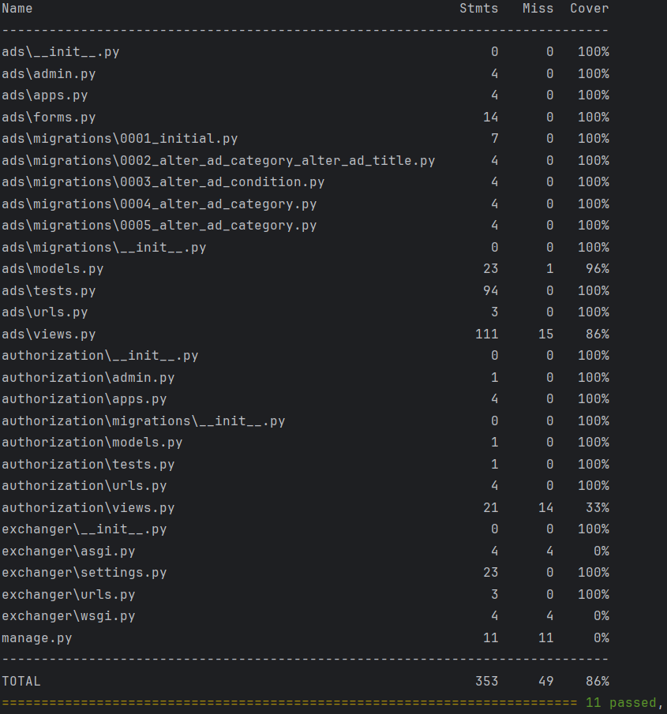

# Django barter platform
Веб приложение, платформа для обмена вещами между пользователями

---

# Возможности
#### 🔐 Авторизация и регистрация учетной записи
#### 📢 Создание объявления об обмене
#### 🔍 Поиск и фильтрация объявлений
#### ♻️ Создание предложения обмена на объявление
#### 📥 Просмотр входящих и исходящих заявок
#### 📚 Пагинация для постепенной загрузки данных

---

# Инструменты
#### 🐍 Python 3.12 & Django 5.2.4
#### 📦 pytest — тестирование
#### 📊 PostgreSQL - база данных

---

# Запуск

Клонируйте проект с github локально на компьютер, установите виртуальное окружение, зависимости в него. Примените миграции, опционально создайте суперпользователя. Запустите сервер
```
git clone https://github.com/BogdanMalashuk/django-exchange-platform.git
cd django-exchange-platform/exchanger

python -m venv .venv
.venv\Scripts\activate

pip install -r requirements.txt

python manage.py migrate

python manage.py createsuperuser (опционально)

python manage.py runserver
```

---

# Тесты
Используются автоматизированные тесты с помощью pytest для проверки ключевого функционала:
создание, редактирование и удаления объявления, поиск и фильтрация объявлений,
создание заявки на обмен

```
pytest --cov=. --cov-report=term
```



---

